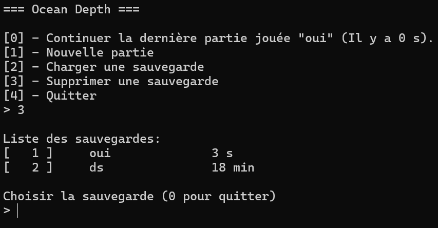
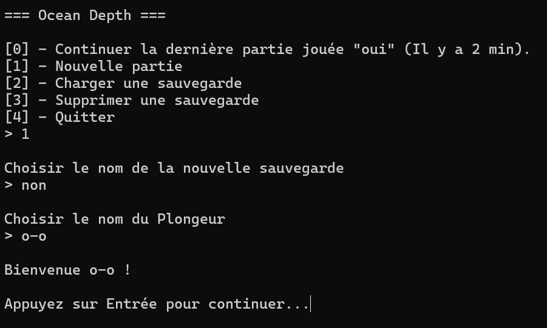
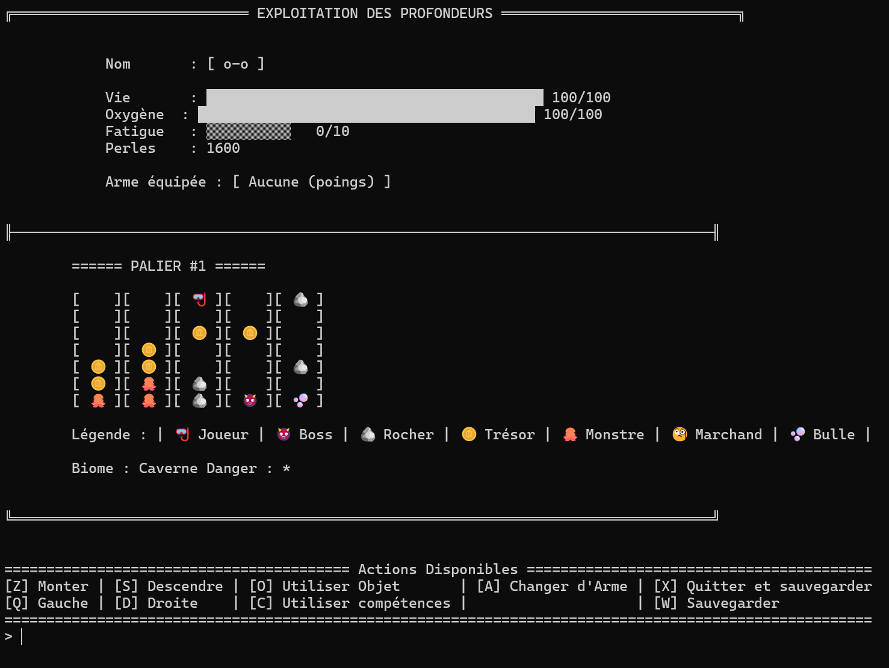
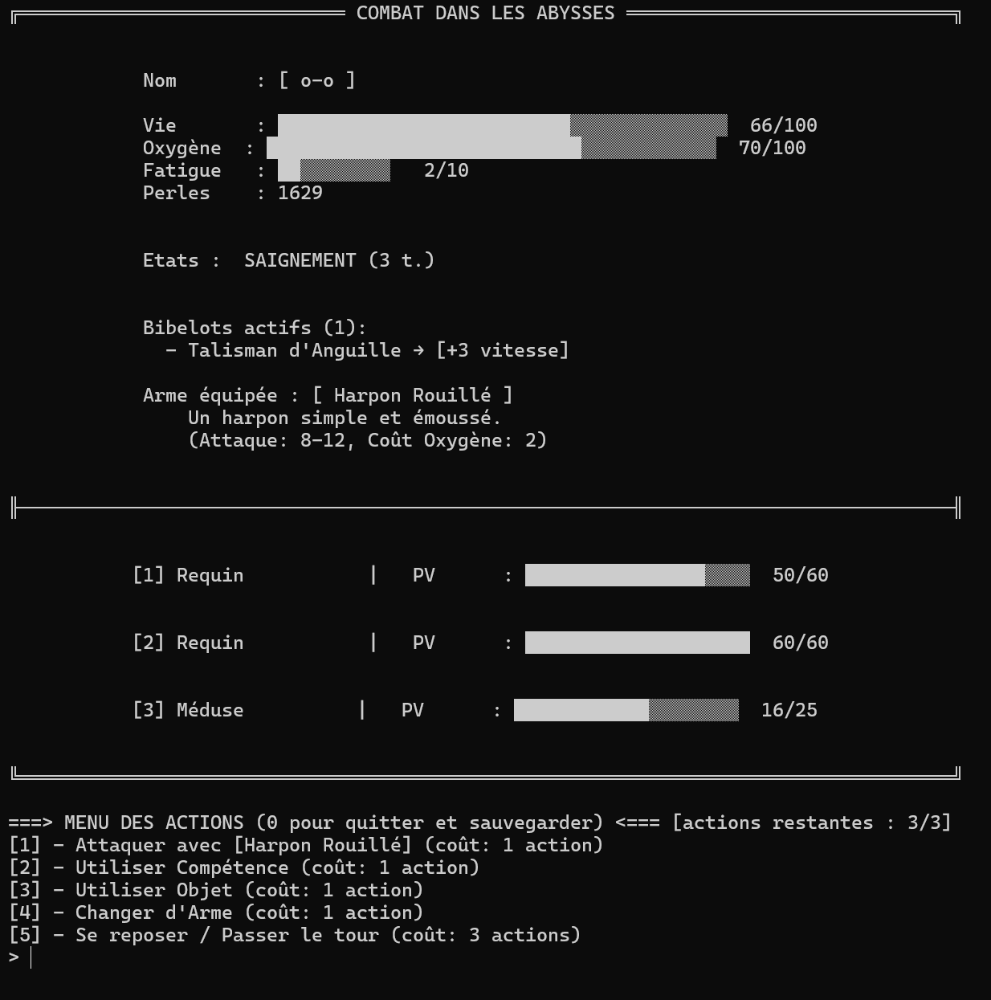
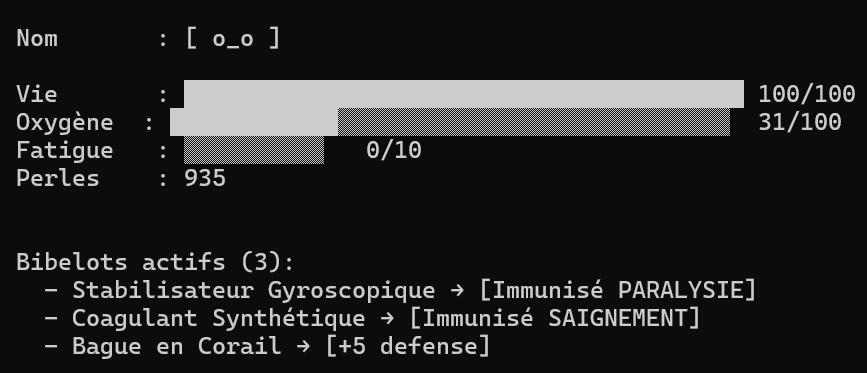
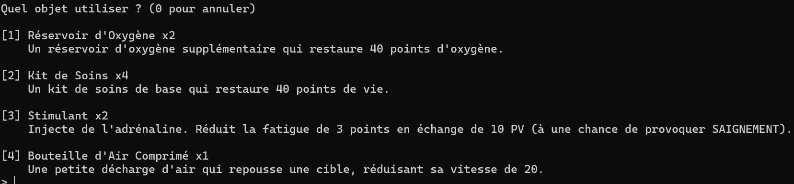
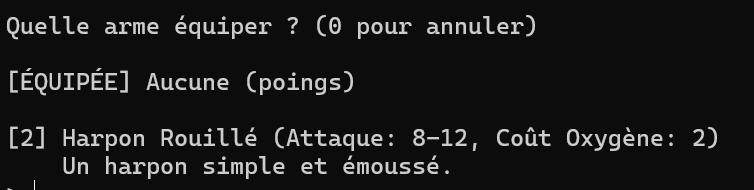
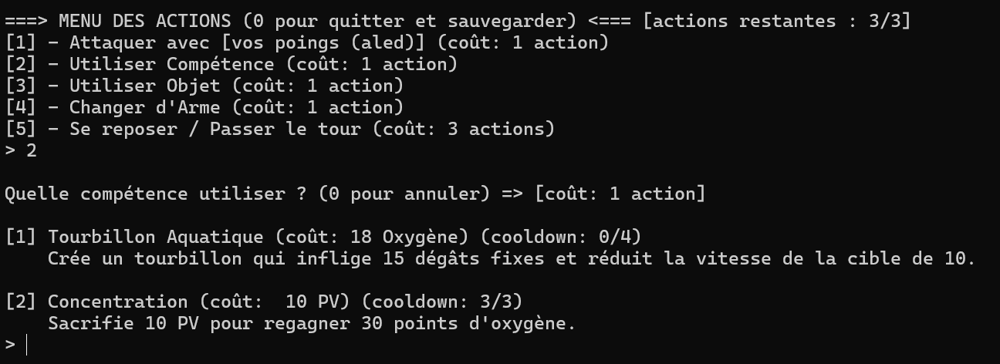
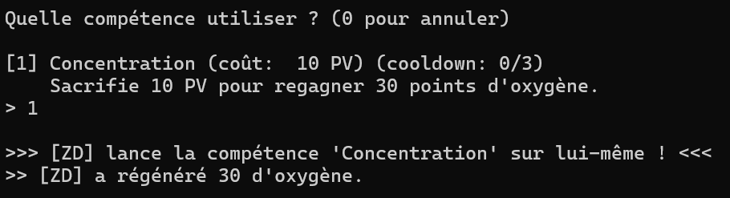

# Progression OceanDepths

Ce fichier documente l'avancement du projet, les difficultés rencontrées et leurs solutions techniques, ainsi que des captures d'écran du gameplay. À lire en complément de la documentation technique du [Wiki](https://github.com/ptitmorceaux/OceanDepth/wiki/).

## Étapes réalisées

[✅] **Étape 1 : Génération créatures**
  - Système de génération de créatures marines avec rareté pondérée
  - Groupes de monstres dynamiques
  - Configuration via fichiers `.conf` (bestiaire)

[✅] **Étape 2 : Attaque joueur**
  - Système de combat au tour par tour
  - Gestion de la Fatigue limitant les actions
  - Consommation d'Oxygène par action

[✅] **Étape 3 : Attaque créatures**
  - Attaques des créatures basées sur leurs compétences
  - Système d'effets de statut (POISON, PARALYSIE, ÉTREINTE, etc.)
  - Ordre d'attaque basé sur la vitesse

[✅] **Étape 4 : Récompenses**
  - Attribution de Perles (monnaie)
  - Système de loot : consommables, armes et bibelots
  - Rareté dynamique (Commun → Aberrant)

[✅] **Étape 5 : Sauvegarde/Chargement**
  - Sérialisation binaire complète de l'état du jeu
  - Sauvegarde du plongeur, inventaire, carte et combat en cours
  - Système de blocs avec tailles pour gestion des pointeurs

[✅] **Étape 6 : Compétences aquatiques**
  - Compétences pour le joueur et les créatures
  - Système de Cooldowns et coûts (PV/Oxygène)
  - Ciblage multiple et effets variés

[✅] **Étape 7 : Cartographie des océans**
  - Génération procédurale des paliers (tiers)
  - Zones spéciales : Boss, Trésors, Marchands
  - Système de seed pour reproductibilité

---

## Captures d'écran

### Menu Principal
*Le menu principal permet de quitter le jeu, créer une nouvelle partie, charger ou supprimer une sauvegarde.*




### Carte d'Exploration
*Interface de navigation dans les différents paliers océaniques.*



### Combat
*Exemple de combat contre plusieurs créatures marines avec affichage des statistiques et effets.*



### Inventaire
*Gestion de l'inventaire avec équipements (armes et bibelots) et consommables.*

- **Bibelots**



- **Consommables**



- **Armes**



### Compétences

- **Lors d'un combat. Toutes les compétences peuvent être effectuées.**



- **Lors de l'exploration. Seul les coméptences de type ciblage `SOI_MEME` peuvent être effectuées (mais ne coute pas d'actions dcp), *[voir wiki](https://github.com/ptitmorceaux/OceanDepth/wiki/05-Comp%C3%A9tences#Ciblage)***



---

## Difficultés rencontrées

### 1. Équilibrage du jeu
**Problème** : Difficulté à trouver le bon équilibre entre la difficulté des créatures, les ressources du joueur et la progression.

**Solution** : Création d'un système modulaire basé sur des fichiers de configuration (`.conf`). Cela permet de :
- Ajuster facilement les statistiques des créatures dans `bestiaire/creatures.conf`
- Modifier les compétences dans `competences.conf`
- Équilibrer les armes et objets dans `objets/*.conf`
- Tester différentes configurations sans recompiler

**Conséquence** : Le jeu est devenu dépendant des fichiers de configuration, mais cela offre une grande flexibilité.

---

### 2. Système de sauvegarde binaire optimisé
**Problème** : Comment sauvegarder toutes les données du jeu (joueur, inventaire, carte, combat) dans un seul fichier binaire tout en gérant les pointeurs et structures dynamiques ?

**Solution** : Implémentation d'un système de **blocs avec métadonnées** :
- Chaque bloc contient sa taille en en-tête
- Les structures avec pointeurs sont sérialisées en stockant d'abord le nombre d'éléments, puis les données
- Lecture séquentielle des blocs lors du chargement
- Fichier temporaire pour éviter la corruption en cas d'erreur

**Avantages** :
- Lecture/écriture rapide (format binaire)
- Fichier unique et compact
- Gestion sécurisée des allocations dynamiques

---

### 3. Système de progression du joueur
**Problème** : Comment modéliser la progression du joueur sans implémenter un système de niveaux traditionnel ?

**Solution** : Progression via les **bibelots** (équipements passifs) :
- Les bibelots augmentent les statistiques de base du joueur (PV max, Attaque, Défense)
- Certains bibelots confèrent des immunités aux effets (POISON, PARALYSIE, etc.)
- La progression devient horizontale : accumulation d'équipements plutôt que de niveaux
- Plus adapté au thème de l'exploration et de la découverte

**Impact** : Système plus original et motivant pour l'exploration, les récompenses sont directement visibles.

---

### 4. Gestion des erreurs et fuites mémoire
**Problème** : Débogage difficile avec allocations dynamiques multiples, risques de fuites mémoire et crashes.

**Solution** : Mise en place d'une stratégie rigoureuse :
- **Messages de debug** : Utilisation systématique de `fprintf(stderr, "[DEBUG] ...")` pour tracer l'exécution
- **Gestion des `free()`** : Libération systématique dans l'ordre inverse des allocations
- **Fonctions de nettoyage** : Création de fonctions dédiées (ex: `liberer_joueur()`, `liberer_creatures()`)
- **Valgrind** : Tests réguliers avec `make -C code/ valgrind` pour détecter les fuites
- **Vérifications NULL** : Contrôle systématique des retours de `malloc()`/`calloc()`

**Résultat** : Aucune fuite mémoire détectée par Valgrind, gestion d'erreurs robuste.

---

### 5. Autres défis techniques *([voir wiki](https://github.com/ptitmorceaux/OceanDepth/wiki))*

- **Génération procédurale** : Garantir un chemin accessible dans chaque palier tout en gardant de l'aléatoire
- **Système d'effets** : Gérer les interactions complexes entre différents effets de statut
- **Configuration modulaire** : Parser les fichiers `.conf` de manière robuste avec gestion des erreurs

---

## Améliorations possibles

- Interface graphique (SDL2/Raylib/...)
- Plus de types de zones et de créatures
- Système d'évenement plus poussé (quêtes/...)
- Multijoueur local (à tour de rôle)

---

## Commandes de test

Compile puis lance le jeu depuis le bon répértoire (`./code/output/`)

```bash
make -C code/ clean && make -C code/ run
```
```bash
make -C code/ clean && make -C code/ valgrind
```

*Extrait du [`Makefile`](./code/Makefile)*

```Makefile
run: all
	cd $(OUTDIR) && ./$(TARGET) && cd ..
```
```Makefile
valgrind: debug
	cd $(OUTDIR) && valgrind -v --leak-check=full --track-origins=yes ./$(TARGET) && cd ..
```
